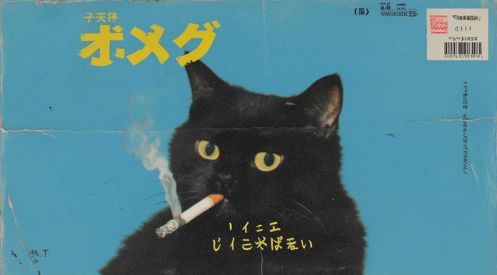
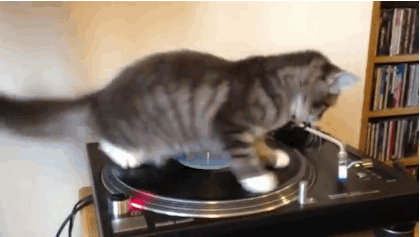

  

  

  

 

---

 

<table>
<tr>
<td width="52%" valign="top">

 

**meow✦**

- i might not find a j*b in this economy
- currently hyper-fixated on **React** and **UX design**
- i draw sometimes 
- im too broke for some of my fav apps so i remake them

</td>
<td width="48%" align="center" valign="middle">

 

  

</td>
</tr>
</table>

 

---

 

### `> right_now.log`

 

<table>
<tr><td>✦</td><td>building little projects that solve little problems</td></tr>
<tr><td>✦</td><td>i hate sql</td></tr>
<tr><td>✦</td><td>im gna switch to linux one day</td></tr>
<tr><td>✦</td><td>i fear unemployment</td></tr>
</table>

 

---

 

### `> stack.config`

 

**languages**

**web & frontend**

**data & ml**

**databases**

**design & tools**

**deploy**

 

---

 

  

    

  <em>pls dont find me around the internet</em>

   

  
     
  

 

  

